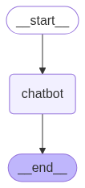
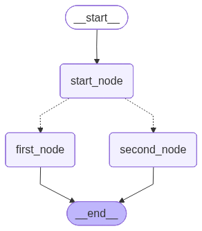

# Groq-Powered Single-Node Chatbot

**Goal:** Minimal LangGraph app with a single chatbot node using a Groq model (e.g., Llama 3.1 8B Instant).

**State:** 
- Shared messages field (human + AI chat history).
- Appends updates to preserve conversation.

**Node Behavior:** 
- Chatbot node reads messages, queries Groq model, appends AI response to messages.

**Setup:** 
- Requires GROQ_API_KEY in environment (map GROQ_AI_KEY if needed).
- Load key before initializing Groq client.

**Why This Pattern:**

- Simple baseline for state management and model integration.
- Easy to extend with routers, tools, or guardrails.

  

## LangGraph Mini‑Workflow

A concise, conceptual guide to a tiny project that demonstrates **stateful workflows** in **LangGraph** with a couple of nodes and a conditional branch.

---

## What this is
A minimal workflow that:
- Passes a shared **State** (your app’s working memory) through nodes.
- Uses **Edges** to control the path, including a simple conditional branch.
- Can be **visualized** as a graph for quick understanding.

---

## Why LangGraph
- **Explicit control flow** for LLM apps (branches, retries, loops) rather than linear chains.
- **Shared state** so nodes can read/write intermediate results cleanly.
- **Debuggable**: easy to see which path executed and how state changed.

---

## Key Concepts
- **State** → Data that flows through the workflow (inputs, intermediate values, outputs).
- **Nodes** → Work units that read/write state (e.g., fetch, analyze, summarize).
- **Edges** → Control flow between nodes. Edges can be static or conditional.
- **Router** → A function or policy that selects the next edge based on the current state.

**In one line:** State is *what* you carry; Edges decide *where* you go next.

---

## Workflow at a Glance
1. **Define State** (what data the workflow carries).
2. **Add Nodes** (each performs a task and updates state).
3. **Connect Edges** (deterministic and/or conditional paths).
4. **Compile** the graph (turn the design into a runnable app).
5. **Run** the workflow (invoke once or stream results).
6. **Visualize** (optional) to inspect paths and state transitions.

---

  

## Routing Strategies
- **Static**: Always go A → B.
- **Conditional**: Choose B or C based on a rule.
- **Content‑aware**: Route using values in the state (e.g., keywords).
- **Model‑guided**: Ask an LLM/tool to pick the next step.

---

## What’s Included
- A tiny graph with a start node and two alternative next steps (first/second), selected via a simple router.
- Optional PNG visualization of the compiled workflow.

---

## Prerequisites
- Python 3.10+.
- (Optional) Jupyter for interactive runs.
- (Optional) Visualization extras if you want PNG rendering.

> Use your preferred package manager (e.g., uv or pip) to add LangGraph and the visualization extras if needed.

## Next Steps
- Replace placeholder nodes with real tasks (search, retrieval, summarization).
- Add logging/telemetry for better observability.
- Persist state or artifacts if you need auditability.
- Introduce retries, timeouts, and guards for robustness.
